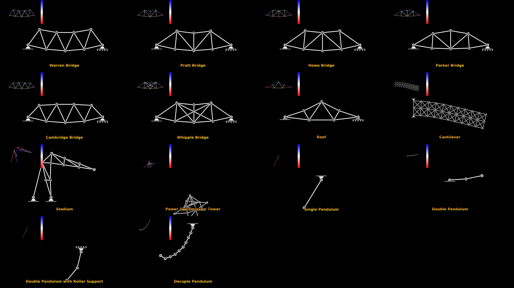
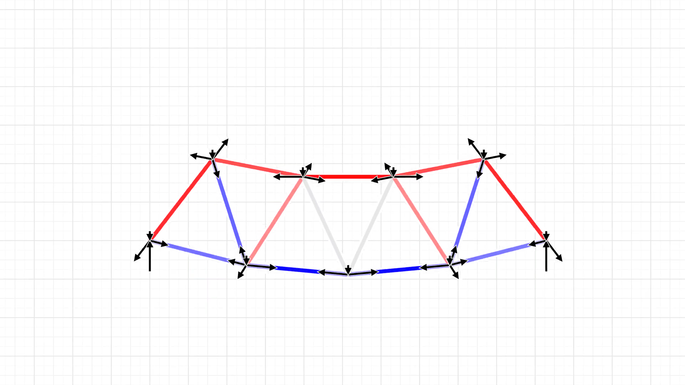

[](https://github.com/Elixonus/trussbox/actions/workflows/quality.yml)
[](https://github.com/Elixonus/trussbox/actions/workflows/build.yml)
[](https://github.com/Elixonus/trussbox/issues)


# Trussbox

## Preview

[Montage Video (2K60FPS)](./previewmt.mp4)

[](./previewmt.mp4)

[Montage (Parallel) Video (2K60FPS)](./previewmtpl.mp4)

[](./previewmtpl.mp4)

[Warren Truss Bridge Video (2K60FPS)](./preview.mp4)

[](./preview.mp4)

[Warren Truss Bridge Force Diagram Video (2K60FPS)](./previewfd.mp4)

[](./previewfd.mp4)

## Steps

### Pre-Requirements

**Installation**: GNU/Linux and apt package manager

**Compilation**: GNU/Linux and gcc-14 C23 or higher

* Recommended distro: Ubuntu 24.04 or higher

**Execution**: GNU/Linux and minimum 2GB memory (for 2K60FPS)

### Setup

```./setup.sh```

### Format

```./format.sh```

### Build

```./build.sh```

### Run

```./bridges.sh```

Creates solutions (videos and force data on each member 
and reactions on each support in the tmp directory) 
for each of the six truss bridges: warren, pratt, howe, 
parker, cambridge and whipple without further 
input.

**or**

```./custom.sh```

Creates solution (videos and force data on each member 
and reactions on each support) for a given problem 
containing input data for joints, members, supports, 
loads as well as other input data provided into standard 
input of the shell script (gravity, duration, frame rate, 
step rate, etc...).

Shell script example input:

```
warren.txt
9.8
3.0
10000.0
60.0
1920
1080
0.5
0.125
1.0
1.0
tmp/warren
```

**or**

```$ ./montage.sh```

## Usage

**(low-level)**

### Conventions

#### Truss Problem Configuration

Raw text example:

```
joints=3
mass=1.0 position=(0.0 0.0) velocity=<0.0 0.0>
mass=1.0 position=(1.0 0.0) velocity=<0.0 0.0>
mass=1.0 position=(1.0 1.0) velocity=<0.0 0.0>
members=3
joint1=1 joint2=2 stiffness=3.0e3 length0=1.0 dampening=3.0e2
joint1=2 joint2=3 stiffness=3.0e3 length0=1.0 dampening=3.0e2
joint1=3 joint2=1 stiffness=3.0e3 length0=1.0 dampening=3.0e2
supports=1
joint=1 axes=xy
loads=1
joint=3 force=<-10.0 -10.0>
```

1. Joints Count *Header*
   * syntax: ```joints=count``` (trailing newline)
   * number of joints in following body
2. Joints Lines *Body*
   * syntax: ```mass=float position=(float float) velocity=(float float)``` (trailing newline)
   * each individual joint mass in kg, position vector in meters 
     and velocity vector in meters per second
3. Members Count *Header*
   * syntax: ```members=count``` (trailing newline)
   * number of members in following body
4. Members Lines *Body*
   * syntax: ```joint1=index joint2=index stiffness=float length0=float dampening=float``` (trailing newline)
   * each individual member joints connection indices, stiffness 
     of spring component in Newtons per meter, resting length in 
     meters and dampening of damper component in Newton seconds per 
     meter
5. Supports Count *Header*
   * syntax: ```supports=count``` (trailing newline)
   * number of supports in following body
6. Supports Lines *Body*
   * syntax: ```joint=index axes=xy|x|y``` (trailing newline)
   * each individual support joint binding and axes of reactions
   * if ```axes=xy```, support is of type pin
   * if ```axes=x```, support is of type vertical roller
   * if ```axes=y```, support is of type horizontal roller
7. Loads Count *Header*
   * syntax: ```loads=count``` (trailing newline)
   * number of loads in following body
8. Loads Lines *Body*
   * syntax: ```joint=index force=<float float>``` (trailing newline)
   * each individual point load joint binding and global space 
     force vector in Newtons

#### Truss Solution Configuration

Raw text example:

```
joints=3
force=<0.000000000e+00 0.000000000e+00> position=(0.000000000e+00 0.000000000e+00) velocity=<0.000000000e+00 0.000000000e+00>
force=<0.000000000e+00 0.000000000e+00> position=(1.000000000e+00 0.000000000e+00) velocity=<0.000000000e+00 0.000000000e+00>
force=<-8.886796564e+02 -8.886796564e+02> position=(1.000000000e+00 1.000000000e+00) velocity=<-4.443398282e-16 -4.443398282e-16>
members=3
force=-0.000000000e+00 displacement=0.000000000e+00 length=1.000000000e+00 velocity=0.000000000e+00
force=-0.000000000e+00 displacement=0.000000000e+00 length=1.000000000e+00 velocity=0.000000000e+00
force=-1.242640687e+03 displacement=4.142135624e-01 length=1.414213562e+00 velocity=0.000000000e+00
supports=1
reaction=<-8.786796564e+02 -8.786796564e+02>
```

1. Joints Count *Header*
   * syntax: ```joints=count``` (trailing newline)
   * number of joints in following body
2. Joints Lines *Body*
   * syntax: ```force=<float float> position=(float float) velocity=<float float>``` (trailing newline)
   * each individual joint force vector in Newtons, 
     modified position vector in meters and modified 
     velocity vector in meters per second
3. Members Count *Header*
   * syntax: ```members=count``` (trailing newline)
   * number of members in following body
4. Members Lines *Body*
   * syntax: ```force=float displacement=float length=float velocity=float``` (trailing newline)
   * each individual member tension force (negative 
     for compression) in Newtons, displacement from 
     resting length in meters, current measured length 
     in meters and velocity of expansion in meters 
     per second
5. Supports Count *Header*
   * syntax: ```supports=count``` (trailing newline)
   * number of supports in following body
6. Supports Lines *Body*
   * syntax: ```reaction=<float float>``` (trailing newline)
   * each individual support reaction force vector in Newtons

### Truss Solver

```./bin/solvetruss gravity=float timef=float srate=float < problem.txt```

* (stdin): [Truss Problem Configuration](#truss-problem-configuration)
* (stdout): [Truss Solution Configuration](#truss-solution-configuration)
* (stderr): error and usage messages
* ```gravity```: gravitational acceleration of a free mass in meters per second squared
* ```timef```: elapsed simulation time in seconds
* ```srate```: frequency of simulation time steps in Hz

### Truss Renderer

```./bin/rendertruss filename fsize=widthxheight "fcenter=(float float)" fzoom=float fscale=float```

* (stdin): [Truss Problem Configuration](#truss-problem-configuration)
* (stderr): error and usage messages
* ```filename```: output render png filename (image of truss in given configuration)
* ```fsize```: renderer resolution in pixels (width and height)
* ```fcenter```: renderer camera center in meters
* ```fzoom```: renderer camera zoom (size of visual elements remain unaffected)
* ```fscale```: renderer scale factor of visual elements

### Truss Force Diagram

```./bin/forcediagram filename gravity=float fsize=widthxheight "fcenter=(float float)" fzoom=float fscale=float```

* (stdin): concatenation of [Truss Problem Configuration](#truss-problem-configuration) and [Truss Solution Configuration](#truss-solution-configuration)
* (stderr): error and usage messages
* ```filename```: output diagram png filename (image of truss in given configuration)
* ```fsize```: diagram resolution in pixels (width and height)
* ```fcenter```: diagram camera center in meters
* ```fzoom```: diagram camera zoom (size of visual elements remain unaffected)
* ```fscale```: diagram scale factor of visual elements
