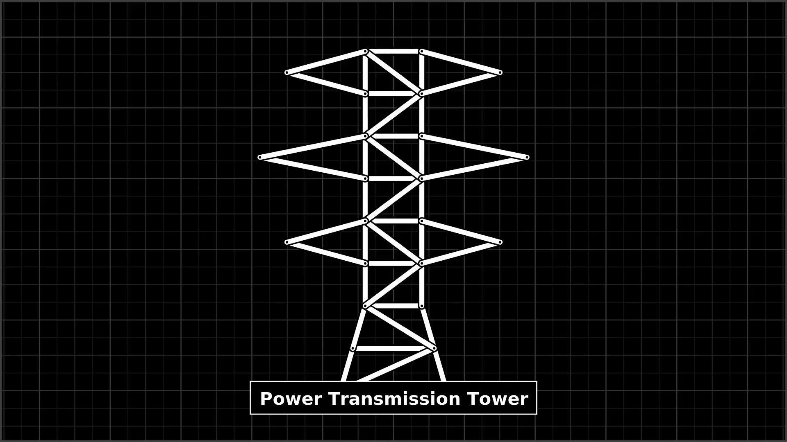
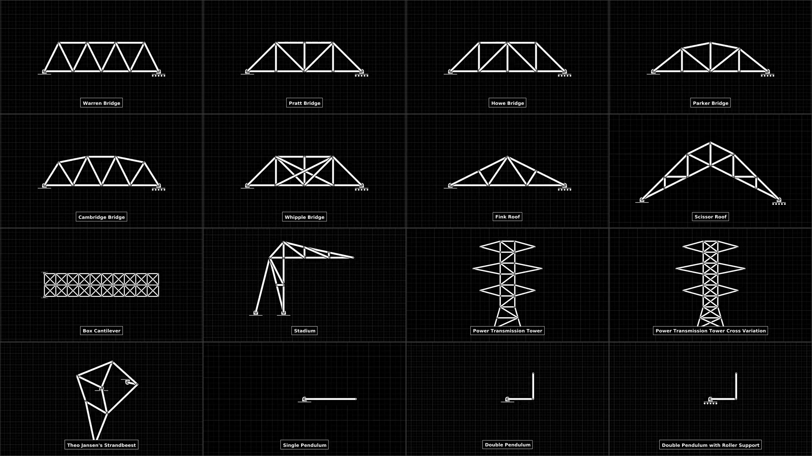
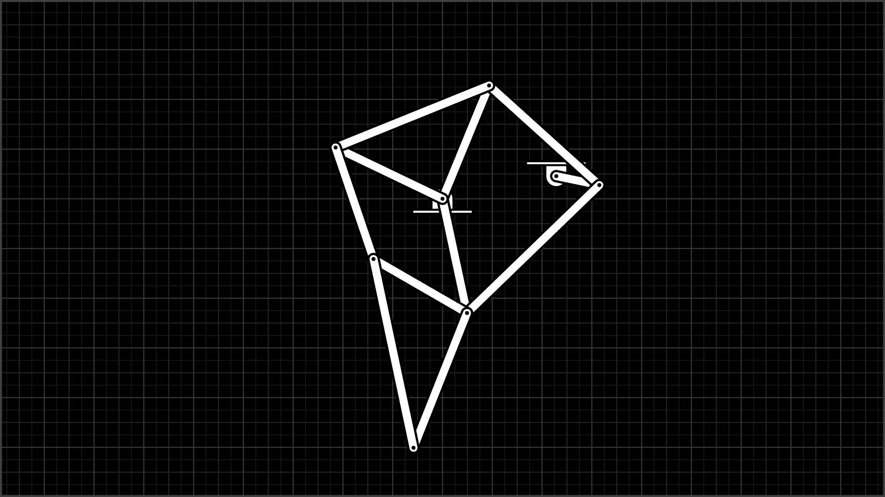
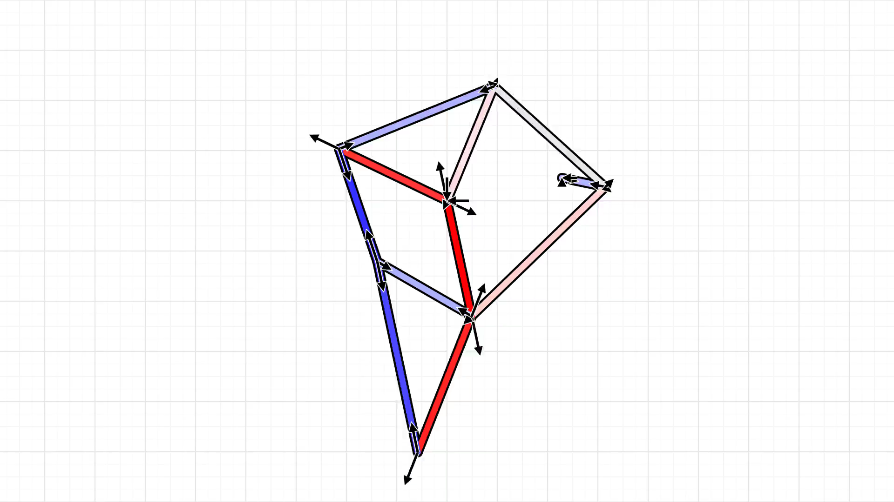

[](https://github.com/Elixonus/trussbox/actions/workflows/build.yml)
[](https://github.com/Elixonus/trussbox/issues)


# Trussbox


Main rendering design from [Simple 2D Constraint Solver Demo by Ange Yaghi](https://github.com/ange-yaghi/scs-2d-demo)

## Preview

[Montage Video (2K60FPS)](./previewmontage.mp4)

[](./previewmontage.mp4)

[Montage (Parallel) Video (2K60FPS)](./previewmontageparallel.mp4)

[](./previewmontageparallel.mp4)

## Steps

### Pre-Requirements

**Installation**: GNU/Linux and apt package manager

**Compilation**: GNU/Linux and gcc-14 C23 or higher

* Recommended distro: Ubuntu 24.04 or higher

**Execution**: GNU/Linux and minimum 2GB memory (for 2K60FPS)

### Setup

```./setup.sh```

### Format

```./format.sh```

### Build

```./build.sh```

### Run

```./custom.sh``` (stdin option)

**or**

```./custom.sh filename=strandbeest.txt gacceleration=0.0 timef=8.0 srate=1000000.0 frate=60.0 fwidth=1920 fheight=1080 fcenterx=0.0 fcentery=-0.5 fzoom=0.2 fscale=1.0 dirname=tmp/strandbeest``` (args option)

Creates solution (videos and force data on each member
and reactions on each support) for a given problem
containing input data for joints, members, supports,
loads as well as other input data provided into standard
input of the shell script (gravity, duration, frame rate,
step rate, etc...).

Shell script example input:

```
warren.txt
9.8
3.0
10000.0
60.0
1920
1080
0.5
0.125
1.0
1.0
tmp/warren
```

**or**

```./bridges.sh```

Creates solutions (videos and force data on each member 
and reactions on each support in the tmp directory) 
for each of the six truss bridges: warren, pratt, howe, 
parker, cambridge and whipple without further 
input.

**or**

```./miscellaneous.sh```

**or**

```./machines.sh```

**or**

```./pendulums.sh```

**or**

```./montage.sh```

## Usage

**(low-level)**

### Truss Solver

```cat problem.txt | ./bin/solvetruss gacceleration=float timef=float srate=float```

* (stdin): [Truss Problem Configuration](#truss-problem-configuration)
* (stdout): [Truss Solution Configuration](#truss-solution-configuration)
* (stderr): error and usage messages
* ```gacceleration```: gravitational acceleration of a free mass in meters per second squared
  (negative for downwards, positive for upwards)
* ```timef```: last simulation time step time in seconds
* ```srate```: frequency of simulation time steps in Hz

### Truss Renderer



```cat problem.txt | ./bin/rendertruss filename fsize=widthxheight "fcenter=(float float)" fzoom=float fscale=float```

* (stdin): [Truss Problem Configuration](#truss-problem-configuration)
* (stderr): error and usage messages
* ```filename```: output render png filename (image of truss in given configuration)
* ```fsize```: renderer resolution in pixels (width and height)
* ```fcenter```: renderer camera center in meters
* ```fzoom```: renderer camera zoom (size of visual elements remain unaffected)
* ```fscale```: renderer scale factor of visual elements

### Truss Force Diagram Renderer



```cat problem.txt solution.txt | ./bin/forcediagram filename gacceleration=float fsize=widthxheight "fcenter=(float float)" fzoom=float fscale=float```

* (stdin): concatenation of [Truss Problem Configuration](#truss-problem-configuration) and [Truss Solution Configuration](#truss-solution-configuration)
* (stderr): error and usage messages
* ```filename```: output diagram png filename (image of truss in given configuration)
* ```gacceleration```: gravitational acceleration of a free mass in meters per second squared
  (negative for downwards, positive for upwards)
* ```fsize```: diagram resolution in pixels (width and height)
* ```fcenter```: diagram camera center in meters
* ```fzoom```: diagram camera zoom (size of visual elements remain unaffected)
* ```fscale```: diagram scale factor of visual elements

### Truss Swept Area Renderer


```cat problems/*.txt | ./bin/sweptarea filename fsize=widthxheight "fcenter=(float float)" fzoom=float fscale=float```

* (stdin): concatenation of multiple (many) [Truss Problem Configuration](#truss-problem-configuration)
* (stderr): error and usage messages
* ```filename```: output visualization png filename (image of truss linkage displacement history given)
* ```fsize```: visualization resolution in pixels (width and height)
* ```fcenter```: visualization camera center in meters
* ```fzoom```: visualization camera zoom (size of visual elements remain unaffected)
* ```fscale```: visualization scale factor of visual elements

### Conventions

#### Truss Problem Configuration

Theo Jansen's Strandbeest Example:

```
joints=8
mass=1.000000000e+00 position=(0.000000000e+00 0.000000000e+00) velocity=<0.000000000e+00 0.000000000e+00>
mass=1.000000000e+00 position=(1.143000000e+00 2.280000000e-01) velocity=<0.000000000e+00 0.000000000e+00>
mass=1.000000000e+00 position=(1.575000000e+00 1.380000000e-01) velocity=<0.000000000e+00 -1.000000000e+01>
mass=1.000000000e+00 position=(4.680000000e-01 1.140000000e+00) velocity=<0.000000000e+00 0.000000000e+00>
mass=1.000000000e+00 position=(2.460000000e-01 -1.149000000e+00) velocity=<0.000000000e+00 0.000000000e+00>
mass=1.000000000e+00 position=(-1.074000000e+00 5.160000000e-01) velocity=<0.000000000e+00 0.000000000e+00>
mass=1.000000000e+00 position=(-6.930000000e-01 -6.060000000e-01) velocity=<0.000000000e+00 0.000000000e+00>
mass=1.000000000e+00 position=(-2.910000000e-01 -2.505000000e+00) velocity=<0.000000000e+00 0.000000000e+00>
members=11
joint1=[2] joint2=[3] stiffness=1.000000000e+05 length0=4.412754243e-01 dampening=1.000000000e+03
joint1=[1] joint2=[4] stiffness=1.000000000e+05 length0=1.232324633e+00 dampening=1.000000000e+03
joint1=[1] joint2=[5] stiffness=1.000000000e+05 length0=1.175039148e+00 dampening=1.000000000e+03
joint1=[3] joint2=[4] stiffness=1.000000000e+05 length0=1.493135292e+00 dampening=1.000000000e+03
joint1=[3] joint2=[5] stiffness=1.000000000e+05 length0=1.850029729e+00 dampening=1.000000000e+03
joint1=[1] joint2=[6] stiffness=1.000000000e+05 length0=1.191525073e+00 dampening=1.000000000e+03
joint1=[4] joint2=[6] stiffness=1.000000000e+05 length0=1.663472272e+00 dampening=1.000000000e+03
joint1=[5] joint2=[7] stiffness=1.000000000e+05 length0=1.084698115e+00 dampening=1.000000000e+03
joint1=[6] joint2=[7] stiffness=1.000000000e+05 length0=1.184924048e+00 dampening=1.000000000e+03
joint1=[5] joint2=[8] stiffness=1.000000000e+05 length0=1.458459804e+00 dampening=1.000000000e+03
joint1=[7] joint2=[8] stiffness=1.000000000e+05 length0=1.941083460e+00 dampening=1.000000000e+03
supports=2
joint=[1] axes={xy}
joint=[2] axes={xy}
loads=0
```

1. Joints Count *Header*
    * syntax: ```joints=count``` (trailing newline)
    * number of joints in following body
2. Joints Lines *Body*
    * syntax: ```mass=float position=(float float) velocity=<float float>``` (trailing newline)
    * each individual joint mass in kg, position vector in meters
      and velocity vector in meters per second
3. Members Count *Header*
    * syntax: ```members=count``` (trailing newline)
    * number of members in following body
4. Members Lines *Body*
    * syntax: ```joint1=[index] joint2=[index] stiffness=float length0=float dampening=float``` (trailing newline)
    * each individual member joints connection indices, stiffness
      of spring component in Newtons per meter, resting length in
      meters and dampening of damper component in Newton seconds per
      meter
5. Supports Count *Header*
    * syntax: ```supports=count``` (trailing newline)
    * number of supports in following body
6. Supports Lines *Body*
    * syntax: ```joint=[index] axes={xy|x|y}``` (trailing newline)
    * each individual support joint binding and axes of reactions
    * if ```axes={xy}```, support is of type pin
    * if ```axes={x}```, support is of type vertical roller
    * if ```axes={y}```, support is of type horizontal roller
7. Loads Count *Header*
    * syntax: ```loads=count``` (trailing newline)
    * number of loads in following body
8. Loads Lines *Body*
    * syntax: ```joint=[index] force=<float float>``` (trailing newline)
    * each individual point load joint binding and global space
      force vector in Newtons

#### Truss Solution Configuration

Theo Jansen's Strandbeest Example:

```
joints=8
force=<0.000000000e+00 0.000000000e+00> position=(0.000000000e+00 0.000000000e+00) velocity=<0.000000000e+00 0.000000000e+00>
force=<0.000000000e+00 0.000000000e+00> position=(1.143000000e+00 2.280000000e-01) velocity=<0.000000000e+00 0.000000000e+00>
force=<-1.924897646e+03 9.597507536e+03> position=(1.574999912e+00 1.379004370e-01) velocity=<-1.853201138e-02 -9.908014981e+00>
force=<4.866518460e+03 -4.411109044e+03> position=(4.680002224e-01 1.139999799e+00) velocity=<4.677640373e-02 -4.236804246e-02>
force=<-4.894829223e+03 -4.691786492e+03> position=(2.459997765e-01 -1.149000216e+00) velocity=<-4.701461205e-02 -4.530948283e-02>
force=<2.398431816e+01 9.802039727e+00> position=(-1.074000000e+00 5.160000001e-01) velocity=<1.086096053e-04 4.421615561e-05>
force=<-1.466608796e+01 8.247068603e+00> position=(-6.930000002e-01 -6.059999999e-01) velocity=<-6.627556866e-05 3.765965475e-05>
force=<-2.072519689e+01 -5.198418530e+01> position=(-2.910000003e-01 -2.505000001e+00) velocity=<-9.373943350e-05 -2.357097579e-04>
members=11
force=2.007722245e+03 displacement=2.022962826e-05 length=4.412956539e-01 velocity=2.005699282e+00
force=-2.030252987e+01 displacement=-1.022870788e-07 length=1.232324531e+00 velocity=-2.029230117e-02
force=3.267559743e+01 displacement=1.644910510e-07 length=1.175039312e+00 velocity=3.265914833e-02
force=6.586358850e+03 displacement=6.645013175e-05 length=1.493201742e+00 velocity=6.579713837e+00
force=-6.853336830e+03 displacement=-6.901320613e-05 length=1.849960716e+00 velocity=-6.846435509e+00
force=-6.061074116e-02 displacement=-5.170974759e-11 length=1.191525073e+00 velocity=-6.060557019e-05
force=2.594808640e+01 displacement=1.303784438e-07 length=1.663472402e+00 velocity=2.593504856e-02
force=-1.701401920e+01 displacement=-8.555581577e-08 length=1.084698029e+00 velocity=-1.700546362e-02
force=-4.454160954e-02 displacement=4.953393251e-11 length=1.184924048e+00 velocity=-4.454656293e-05
force=-5.615733072e+01 displacement=-2.821528446e-07 length=1.458459522e+00 velocity=-5.612911543e-02
force=2.330313412e-01 displacement=1.117602011e-09 length=1.941083461e+00 velocity=2.329195810e-04
supports=2
reaction=<8.148812387e-01 5.075922909e+01>
reaction=<-1.965430257e+03 4.099176931e+02>
```

1. Joints Count *Header*
    * syntax: ```joints=count``` (trailing newline)
    * number of joints in following body
2. Joints Lines *Body*
    * syntax: ```force=<float float> position=(float float) velocity=<float float>``` (trailing newline)
    * each individual joint force vector in Newtons,
      modified position vector in meters and modified
      velocity vector in meters per second
3. Members Count *Header*
    * syntax: ```members=count``` (trailing newline)
    * number of members in following body
4. Members Lines *Body*
    * syntax: ```force=float displacement=float length=float velocity=float``` (trailing newline)
    * each individual member tension force (positive
      for in tension, negative for in compression) in Newtons, displacement from
      resting length in meters, current measured length
      in meters and velocity of expansion in meters
      per second
5. Supports Count *Header*
    * syntax: ```supports=count``` (trailing newline)
    * number of supports in following body
6. Supports Lines *Body*
    * syntax: ```reaction=<float float>``` (trailing newline)
    * each individual support reaction force vector in Newtons